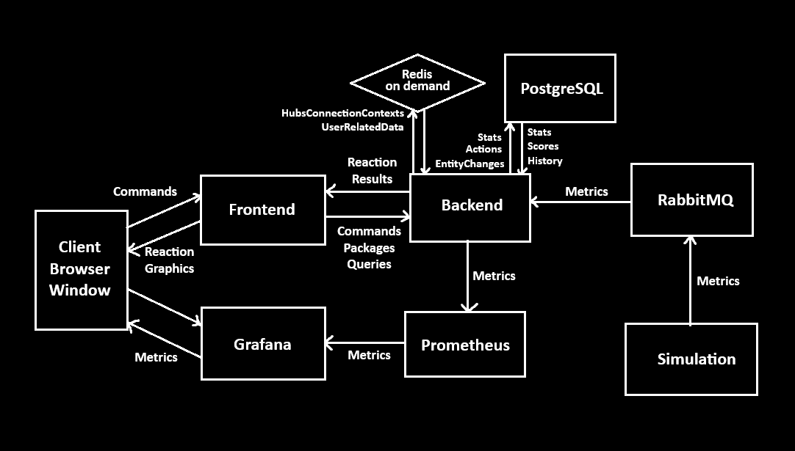

# Никто не хочет со мной работать, поэтому я буду разводить здесь свою жижу. 

## Симулятор марсианской базы ( успею до 2030, быстрее space X )
### Цель:
- Симуляция работы марсианской базы на C# ( отдельный проект, собранный как dll, запущенный в backend контейнере )
- Использование **C# как Backend** для управления симуляцией и взаимодействия с миром ( REST, RPC ). Это будет единственный способ прямого взаимодействия. Фронт будет только показывать результат.
- Использование **TypeScript + React + three.js** как Frontend + "геймифицированная симуляция" с крутыми ( или нет ) шейдерами на glsl.
- Использование **Prometheus + Grafana** для создания симуляции аналитического центра управления колонией ( графики, показатели, статистика и прочие очень интересные цифорки )
- Использование **OpenTelemetry** для анализа загрузки процессов.
- Интерфейс для управления колонией ( Backend ) с автодоками OpenAPI ( swagger ) для создания возможности написания своих скриптов и программ
- Можно ещё **Redis** подтянуть куда нужно ( при необходимости ).
---
### Описание:
То есть: 
- запускается postgres.
- запускается аналитика.
- запускается бэк, который подключается и запускает контейнер с симуляцией.
- запускается контейнер с симуляцией, в нём есть API для управления через бэк, который при подключении сигналит о начале симуляции.
- запускается фронт
  
  
---
###  Важно:
- Колония должна состоять из множества компонентов ( микросервисов ), по аналогии того, что каждый отдельный отсек для чего-то предназначен, у него есть своя зона ответственности, свой функционал, следовательно, своё API, а значит это вполне себе микросервис.
- Колония должна взаимодействовать с внешним миром, а мир с ней ( события короче надо будет создать )
- Надо накрутить свагу на всё, что заэкспожено и должно управляться извне, чтобы можно было посмотреть что и как можно двигать.
---
### Примечания:
- Самое крутое, что это абсолютно скалируемый проект. Можно в любой момент добавить что угодно. Отличный тренажёр и песочница, короче.

---

# И так, концепция:
NASA запустило на марс пилотируемую миссию для постройки и освоения колонии. Вы будете выполнять роль удалённого центра принятия решений с Земли. Ваша задача - развивать колонию и не допустить её исчезновения. От вас требуется грамотный менеджмент ресурсов и взвешенные аналитические решения. Жизнь на марсе сурова, а ресурсы не бесконечны, каждая жизнь на счету. Не подведите мечту одного очень богатого человека!
  
<small>Ну, и люди там, их тоже жалко</small><b>, но скажите мне, КАК МОЖЕТ СУЩЕСТВОВАТЬ ЧЕЛОВЕК БЕЗ МЕЧТЫ?!</b>
 

<small>( Все совпадения случайны, автор никого не имел в виду )</small>

 

# План работ:
( и примерные временные отрезки, за которые нужно сделать ту или иную штуку )

**АЛЯРМ! Перед началом обязательно прочитать файлы из .project_info**. Чтобы восстановить концепцию в голове.

### Неделя 1-2
- Продумать, описать и настроить архитектуру для симуляции, продумать "геймплей", определиться с "механиками". Так же написать диздок.
- Написать Backend, собрать каркас для основного управления ( дать заказ дрону, включить / отключить модуль, перевести людей, назначить экспедицию, заказать постройку, проверить ресурсы и т.д. ) Пока что без simulation, она будет написана позже.
- Logger ( файловый и консольный )

### Неделя 2-3
- Написать тесты для бэкенда ( точнее их каркас ).
- Развернуть Postgresql, сделать таблицы под сущности для симуляции, бэка и метрик, разделить по схемам ( "simulation", "backend", "metrics" )
- настроить docker-compose
- Logger ( в базу данных )
- Написать тесты для сетевого взаимодействия ( запись в бд, удаление и прочее непотребство )

### Неделя 3-4
- развернуть Redis и оставить его "на низком старте" до надобности ( или использовать сразу, как пойдёт )
- развернуть RabbitMQ, подключиться к нему на Backend'е
- развернуть metrics, сделать все нужные графики и статистику.
- перенаправить все запросы с simulation на backend, а потом по RabbitMQ на metrics для отображения.
- Дополнить тесты для вышеперечисленного ( в том числе тесты на загруженность ( .project_info содержит нужную информацию по этой теме) )

---
#### В первый месяц должно быть готово:
- Backend управление
- Развёрнутый Месседж-брокер
- Развёрнутая База данных
- Развёрнутая Аналитика
- Эти контейнеры должны успешно обмениваться данными внутри сети docker.
---

### Неделя 5-9
- Основные компоненты готовы, теперь можно приступать к созданию симуляции и внедрению метрик в неё.
- Создать набор симулируемых сущностей.
- Создать логику симуляции для автономной работы.
- Сделать генерацию карты ( позже будет выстраиваться во фронте как плоскость ). От неё будет зависеть маршрут сущностей. По ней же будут строиться пути.
- Интегрировать мой NavMesh с DND сюда, чтобы можно было строить пути для дронов или экспедиций.
- Прописать взаимодействие сущностей с другими сущностями.
- Создать всевозможные подсимуляции для автономных процессов. ( потоки будут плакать. )
- Тестировать вышеперечисленное.
- Прокинуть в backend все метрики.

### Неделя 9-10
- Протестировать симуляцию, прописать и протестировать сценарии ( катастрофы, отключение модулей, короче, приколы всякие ) , проверить метрики, просмотреть базу данных, пройтись стресс-тестами.
- Исправить ошибки ( возможно ), проверить боттлнеки и исправить, активно подсасывать редис во все душные места.
- Отдохнуть ( зачиллиться ( забалдеть ) ).

---

#### Во второй-третий месяц должно быть готово:
- Полностью функциональная симуляция ( можно управлять колонией, отдавать указания, видеть результат работы, получать обратную связь )
- Устойчивая система работы с симуляцией, прошедшая стресс-тесты и юнит-тесты.
- По сути уже готовый самодостаточный проект.

---

### Неделя 10-13
- Создание 3D моделей для симуляции в блендере
- UI/UX
- Саунд-дизайн
- Создание frontend каркаса, реализация файловой архитектуры.
- Написание Utility кода для three.js и сетевого взаимодействия
- Создание стандартных "компонентов" ( свет, управление )
- Сделать кнопку для редиректа на metrics ( пока нет графики - будет так )
- Тестирование ( здесь происходит вручную )

### Неделя 13-15
- Добавить модели
- Прописать взаимодействие фронта с бэком, запрашивать с бэка метрики для сущностей.
- Сделать "логгер событий" из RabbitMQ во фронт, чтобы можно было видеть что происходит ( можно типа как чат сделать сбоку, или выезжающий )
- Написать тесты для вышеперечисленного.
- Добавить графические эффекты, шейдеры, ну и так далее.

### Неделя 15-...
- Развивать дальше по желанию.

 
 

# НАЧАЛО ПОРКИ ОБЪЯВЛЯЮ ПЕРВОГО СЕНТЯБРЯ ( отдаём дань классике ) 25 ГОДА
