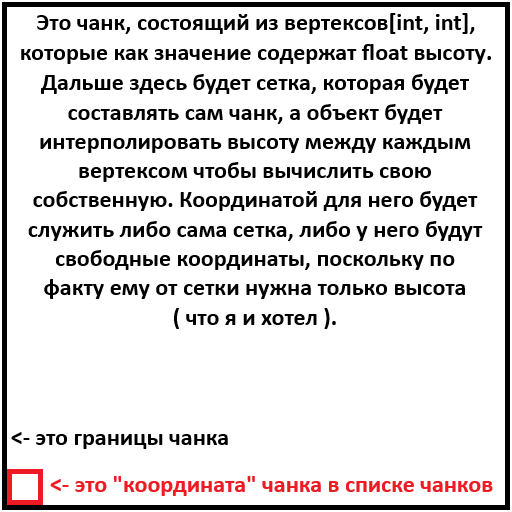

# Идея:
У меня будет сетка из точек с координатами (сама сгенерированная карта). У этих точек будет высота.
Они будут выступать в роли вертикалей. Объект будет перемещаться по координатам, 
передвигаясь по этой поверхности. Если объект будет находиться между точками, 
его высота будет вычисляться на основании интерполированной высоты этих точек.

Фрагменты карты будут храниться списками фрагментов ( как чанки ) - 
\[int, int]\(Chunk), где int, int - это левый нижний угол, а все чанки должны 
быть квадратными, при том эти int, int - это левый нижний элемент чанка.

  

  

